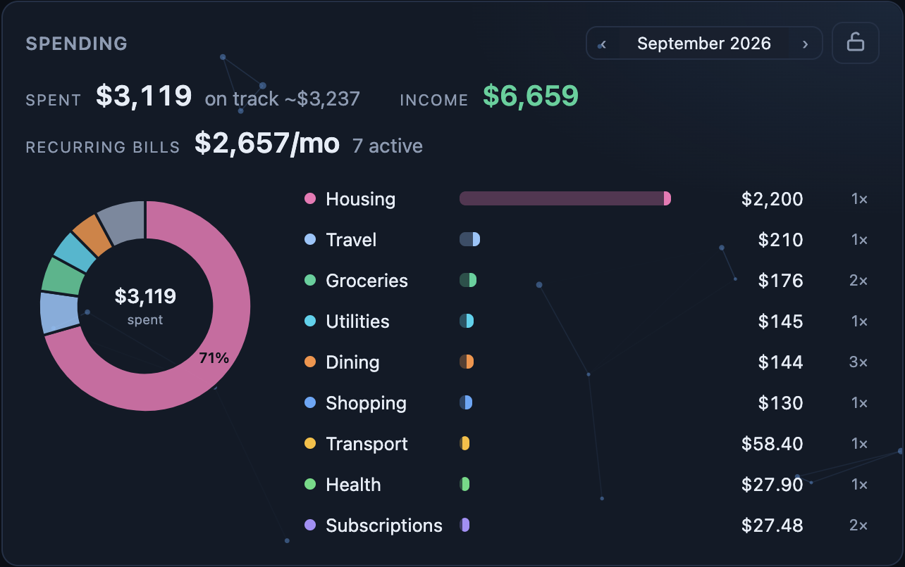
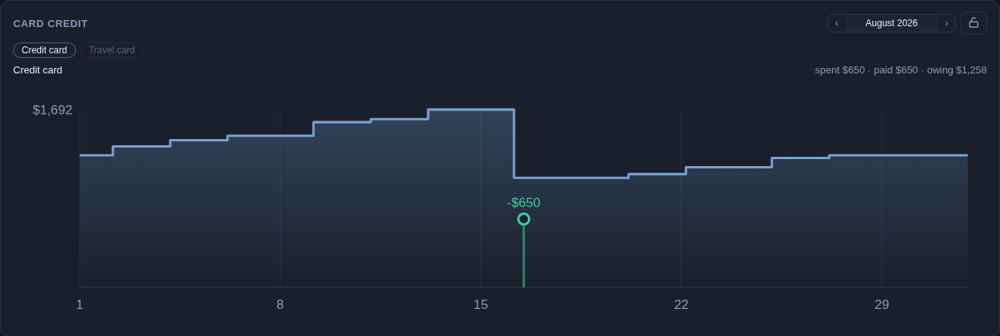

<p align="center">
  <picture>
    <source media="(prefers-color-scheme: dark)" srcset="docs/brand/wordmark-dark.png">
    
  </picture>
</p>

<p align="center">
  Your <a href="https://netwrth.app">netwrth</a> dashboard in Home Assistant —
  the app's own charts, censored by default, revealed by PIN for a window you control.
</p>

<p align="center"></p>
<p align="center"><sub>The whole set on one dashboard, on the bundled <code>netwrth</code> theme with sample data (<code>demo: true</code>). Same cards on the visionOS glass theme with <code>theme: ha</code>: <a href="docs/img/showcase-glass.png">showcase-glass.png</a>.</sub></p>

## Install

1. **HACS** → ⋮ → *Custom repositories* → add `https://github.com/eduser25/netwrth-home-assistant` as **Integration**, install, restart.
2. **netwrth** → *Settings → Integrations → New API key*. Two scopes:
   - `censored only` — can never see real amounts, only percentages. No PIN. Good for wall tablets — but note: if your netwrth account has spending analysis, this scope does see spending *metadata* (merchant names, dates, themes, recurring streams); only the dollars stay hidden.
   - `full access` — still starts censored; real amounts appear only after a PIN reveal, and auto-conceal after a timer.
3. **HA** → *Settings → Devices & services → Add integration → netwrth* → paste the key.

Cards register themselves. YAML-mode dashboards add the resource manually:

```yaml
lovelace:
  resources:
    - url: /netwrth_static/netwrth-cards.js
      type: module
```

## Privacy

Amounts are redacted **server-side, before they leave your netwrth deployment**, rescaled to percent-of-total — trends survive, dollars don't. The lock on any card opens a PIN pad; the reveal window is key-level, so unlocking one card unlocks every card on every device, and concealing (never needs a PIN) re-locks them all. Chart data flows over websocket, never recorded entities, so revealed amounts stay out of HA's database.

<p align="center"></p>

## Cards

All cards share: `entry` (which netwrth connection), `title`, `theme: netwrth | ha`, `background`, `auto_conceal_minutes`. Anything with a header toggle can also be fixed by config — set the value and hide its selector.

- `theme: netwrth` (default) is the app's own dark look. `theme: ha` makes the card follow the active Home Assistant theme — colors *and* card chrome (`ha-card-background`, border, shadow, backdrop blur), so on a glass theme like [visionOS](https://github.com/Nezz/homeassistant-visionos-theme) the netwrth cards turn to glass along with everything else. Chart grid, axes and tooltips follow too; series colors stay fixed so a hue keeps its meaning.
- `background: plexus | mesh | dots | contour | off` paints the web app's ambient canvas effect behind the card's content. Default: `plexus` on the netwrth theme, `off` when following the HA theme. Animation pauses off-screen and respects `prefers-reduced-motion`.
- The total line is the web dashboard's: blue-to-mint gradient stroke with a glowing endpoint; the stat card's change is a tinted chip with a composition bar under it.

`themes/netwrth.yaml` ships the same palette as a Home Assistant theme (`netwrth` solid, `netwrth glass` translucent over an aurora ground) — drop it in your `themes/` folder so native tiles sit on the netwrth colors too.

### Total over time — `netwrth-worth-card`

The dashboard chart with the web app's views (day-to-day / investments / everything) and modes.

<p align="center"></p>

```yaml
type: custom:netwrth-worth-card
view: all                  # daily | invest | all
mode: total                # total | stacked | category | flow
range: 6m                  # 1d 1w 1m 3m 6m 1y all
compact: true              # $1.2M axis labels instead of $1,200,000
show_mode_selector: false  # pin the mode: hide its toggle
show_range_selector: false # pin the range: hide its toggle
```

**Stacked** shows what moved the total: each bar is one day/week/month, split by account — gains stack up from the axis, losses stack down, and the dotted trace is the net change:

<p align="center"></p>

**Category** splits retirement vs taxable vs debt:

<p align="center"></p>

### Net flow — `netwrth-flow-card`

Money kept vs burned per day/week/month over the day-to-day accounts (cash + credit). Balance deltas stand in for income minus spending: green kept, red burned.

<p align="center"></p>

```yaml
type: custom:netwrth-flow-card
range: 3m                  # + the same selector/pinning options as above
```

### Stat — `netwrth-stat-card`

One big number, plus the change over the window in dollars and percent. Censored, the real percent change takes the big slot instead.

<p align="center">
  
  
</p>

```yaml
type: custom:netwrth-stat-card
title: Total
view: all
range: 1m
show_range_selector: false # optional: pin the range
show_composition: false    # optional: hide the composition bar
layout: banner             # optional: one slim row for a full-width strip
```

### Accounts — `netwrth-accounts-card`

Grouped by kind: balance, change over the selected window, and a sync-freshness dot (green fresh, amber stale). Censored, balances read as share of the total.

<p align="center"></p>

```yaml
type: custom:netwrth-accounts-card
view: all
range: 1m                  # window for the change column
show_range_selector: false # optional: pin the range
accounts:                  # optional: only these (name match, case-insensitive)
  - Savings
  - Roth IRA
```

### Spending — `netwrth-spending-card`

Counterpart of the web dashboard's spending tab summary: the Spent / Income / Recurring stat strip, the share-of-spending donut, and the "where it went" theme bars with a read-only transaction drill-down. Month stepper in the header. Spending analysis is a per-user netwrth feature — accounts without it see an error note instead of the card.

<p align="center"></p>

```yaml
type: custom:netwrth-spending-card
show_stats: true    # optional: the Spent / Income / Recurring strip
show_donut: true    # optional: the share donut
```

### Recurring bills — `netwrth-bills-card`

The month's bill calendar: lollipops by day of month — filled chip with a theme-colored ring where the charge landed, hollow where it's still expected, amber where it was expected but never arrived — income pills along the top, a today line, and sub-monthly + lapsed streams in the chip strip.

<p align="center"></p>

```yaml
type: custom:netwrth-bills-card
```

### Card credit — `netwrth-cardcycle-card`

Per credit card (tabs when you have several): the balance's climb and payment drops across the month, payments as green drop-line markers, a fainter stretch where the balance is reconstructed from transactions before the first snapshot, and a hover readout that says which is which.

<p align="center"></p>

```yaml
type: custom:netwrth-cardcycle-card
```

## Sensors

Censor-safe and always created:

- **Total change (day / week / month / year)** — % change of the total over each window.
- **Cash / Investment / Credit / Loan / Other share** — each kind's % of the total.
- **Last balance update** — timestamp of the newest balance.
- **Accounts** — count of visible accounts.
- **Censored** (binary) — on while amounts are censored.
- **Data stale** (binary, problem) — on when the newest balance is older than 48 h.

Real-currency sensors — **Total** plus a per-kind total each — are an explicit opt-in in the integration options (the option only appears on full-access keys). They ship disabled in the entity registry, so enable the ones you want by hand, and they go **unavailable while censored**: dollars only reach HA's recorder during a reveal window.

Entity ids are prefixed with the device name, which comes from your API key's label — a key labeled `Wall tablet` yields `sensor.netwrth_wall_tablet_total_change_week`:

```yaml
# alert on a bad week
automation:
  - trigger:
      - platform: numeric_state
        entity_id: sensor.netwrth_wall_tablet_total_change_week
        below: -5
    action:
      - action: notify.mobile_app_phone
        data:
          message: "balances down {{ states('sensor.netwrth_wall_tablet_total_change_week') }}% this week"
```

## Services

`netwrth.reveal` (fields: `code`, optional `ttl_minutes`, `entry_id`) and `netwrth.conceal`:

```yaml
# re-censor every screen at night
automation:
  - trigger:
      - platform: time
        at: "22:00:00"
    action:
      - action: netwrth.conceal
```

## Options

*Devices & services → netwrth → Configure*: polling interval (15 min), default auto-conceal window (15 min, 0 = stay revealed), real-currency sensor opt-in (full-access keys only).

## Development

```sh
cd cards && npm install && npm run typecheck && npm run build
# emits custom_components/netwrth/frontend/netwrth-cards.js
```

HA serves the bundle with `?v=<manifest version>` as cache-buster — bump `version` in `custom_components/netwrth/manifest.json` with any bundle change, or browsers keep the old cards.

Chart components under `cards/src/{components,lib}` are vendored from the netwrth web app — the rendering is code-identical. Screenshots show demo data.
